# AWS Deployment Guide: RDS & Elastic Beanstalk for Microservices

## Overview

This guide provides instructions for deploying your three ASP.NET Core microservices to one AWS Elastic Beanstalk
environment (three processes on one instance) with RDS
PostgreSQL databases.

---

## Part 1: RDS PostgreSQL Database Setup

### Create Database Instance

One RDS instance holds all three databases. You create the first one (`userservicedb`) here; the other two are
created automatically by the services themselves when they first start (see Part 2).

**AWS Console → RDS → Create database**

> **Sandbox limits (read before you click anything):** the sandbox IAM policy only allows `rds:CreateDBInstance` when
> the instance class is exactly `db.t3.micro`, storage is 21 GiB or less, and Multi-AZ is off. Any other combination is
> denied with an `rds:CreateDBInstance` authorization error, no matter how correct the rest of the form is. Also:
>
> - Make sure the console region is **US East (N. Virginia) us-east-1**. Every RDS and EC2 permission is scoped to it.
> - Choose the **Sandbox** template (older consoles call it **Free tier**; **Dev/Test** also works). The **Production**
>   template preselects Multi-AZ.
> - Credentials management must be **Self managed**. The console defaults to Secrets Manager, which is not permitted.
> - Untick **Enable storage autoscaling** and leave **Enhanced Monitoring** off.

**Required Configuration:**

| Setting                | Value                      | Notes                               |
|------------------------|----------------------------|-------------------------------------|
| Deployment             | Single-AZ DB instance      | Multi-AZ is denied by the sandbox   |
| DB instance identifier | `library-microservices-db` | Unique name for your instance       |
| Master username        | `postgres`                 | Database admin user                 |
| Master password        | Create secure password     | Save this - required for connection |
| Credentials management | Self managed               | Secrets Manager is not permitted    |
| Instance class         | `db.t3.micro`              | Burstable classes. Only class the sandbox allows |
| Storage type           | General Purpose SSD (gp2)  | Default option                      |
| Allocated storage      | 20 GiB                     | Sandbox maximum is 21 GiB           |
| Compute resource       | Don't connect to EC2       | Manual configuration                |
| Network type           | IPv4                       | Standard                            |
| VPC                    | Default VPC                | Must match Elastic Beanstalk        |
| DB subnet group        | default                    | Use existing                        |
| Public access          | No                         | Security best practice              |
| VPC security group     | default                    | Will configure later                |
| Initial database name  | `userservicedb`            | Must be filled in. The other two databases are created by the services |

### Step-by-step with screenshots

These were taken creating an instance called `java-capstone` with initial database `librarydb`. Use
`library-microservices-db` and `userservicedb` instead; every other field is identical.

**1. Start in the right region.** URL and region picker both say `us-east-1`. Click **Create database**.

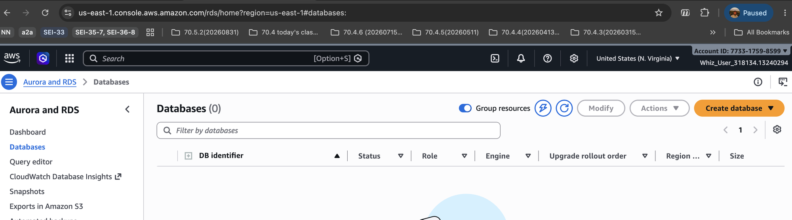

**2. Engine, creation method, template.** PostgreSQL, **Full configuration**, **Sandbox**.

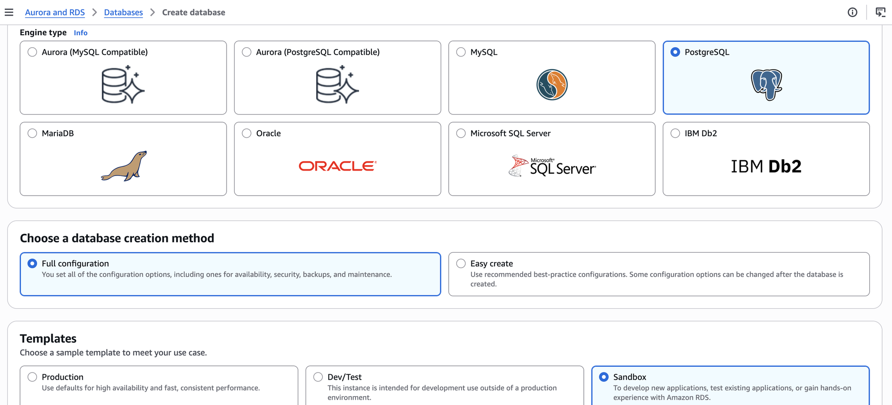

**3. Identifier and credentials.** `library-microservices-db` (not "java capstone as in the below screenshot" ;), master username `postgres`, **Self managed**, type
and confirm a password, write it down.

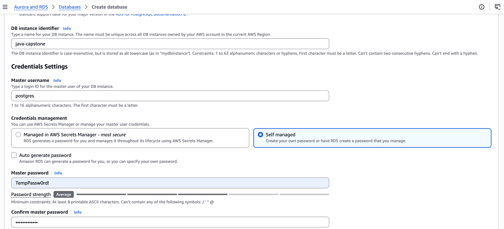

**4. Instance class and storage.** Burstable classes → **`db.t3.micro`**. gp2, **20** GiB.

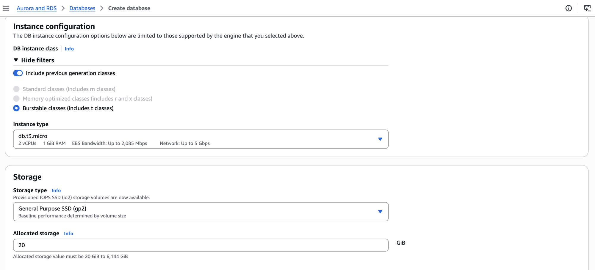

**5. Storage autoscaling and connectivity.** Untick **Enable storage autoscaling**. Don't connect to an EC2 compute
resource. Default VPC, default subnet group, Public access **No**, security group **default**.

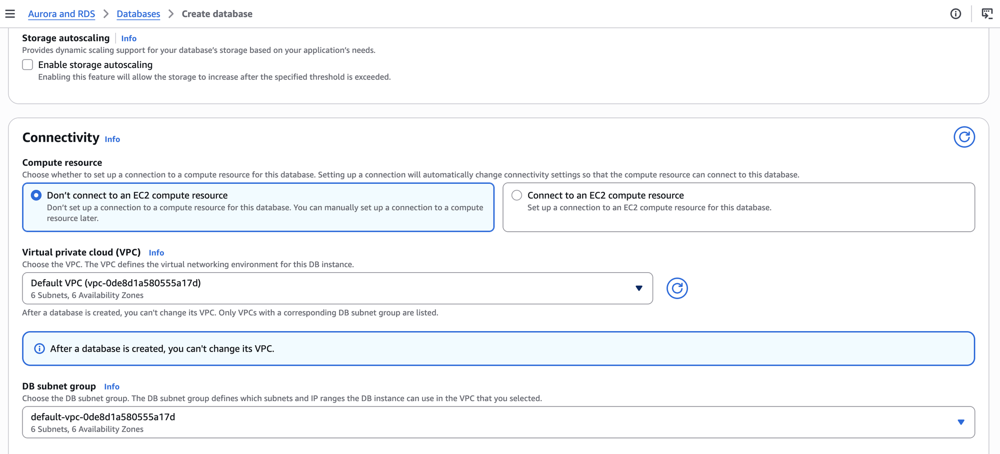

Further down in Connectivity: Public access **No**, VPC security group **Choose existing** with `default` selected,
Availability Zone No preference, no RDS Proxy, port 5432.

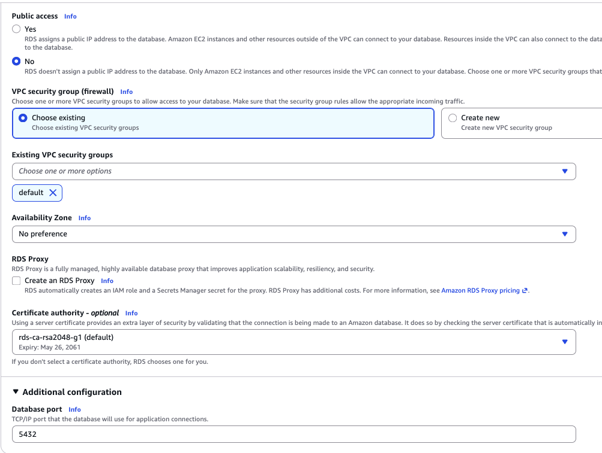

**Monitoring.** Database Insights **Standard**, leave "Collect detailed database and per-query metrics" unticked,
and under Additional monitoring settings leave **Enable Enhanced monitoring** unticked. The red "Error loading KMS
Keys" box is expected in the sandbox and does not affect anything.

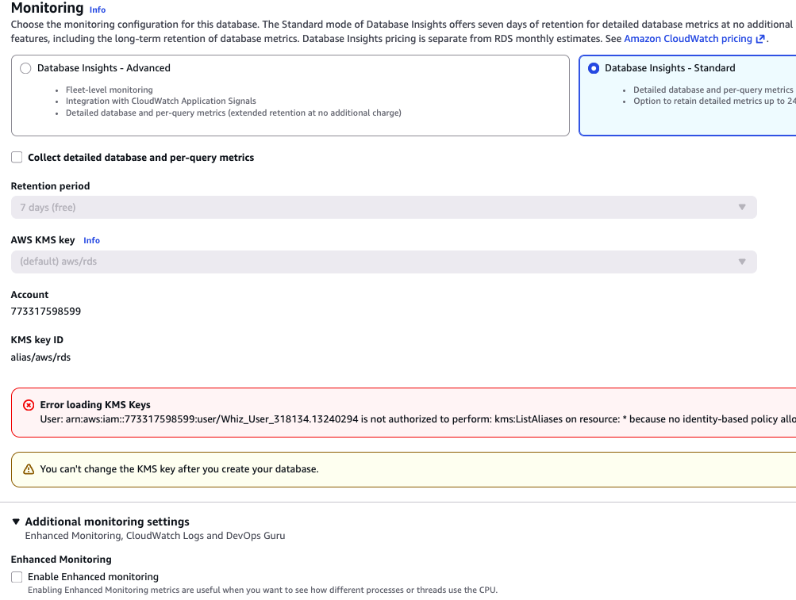

**6. Additional configuration.** Expand it. **Initial database name: `userservicedb`**. Leave it blank and no
database is created at all.

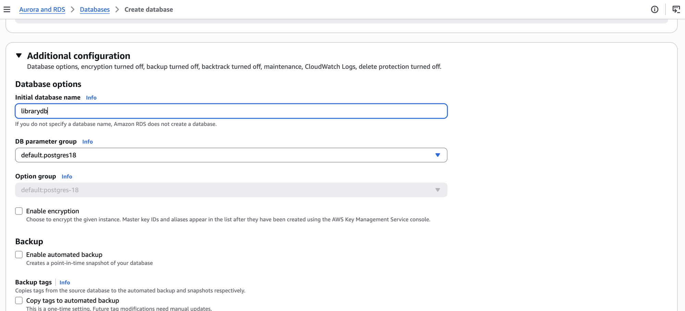

**7. Create database.** Status **Creating**, size `db.t3.micro`. The blue banner is normal.

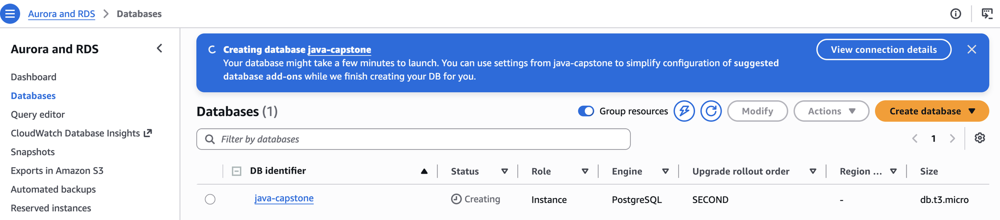

Ignore any red "Error loading KMS Keys ... kms:ListAliases" box in the Monitoring section; nothing here needs KMS.

**After Creation:**

- Wait for status to show "Available" (5-10 minutes)
- Click the instance → **Connectivity & security**
- Copy the **Endpoint**. Format: `library-microservices-db.xxxxx.us-east-1.rds.amazonaws.com`
- Note that the instance is in the `default` security group. You will need that name in Part 3.

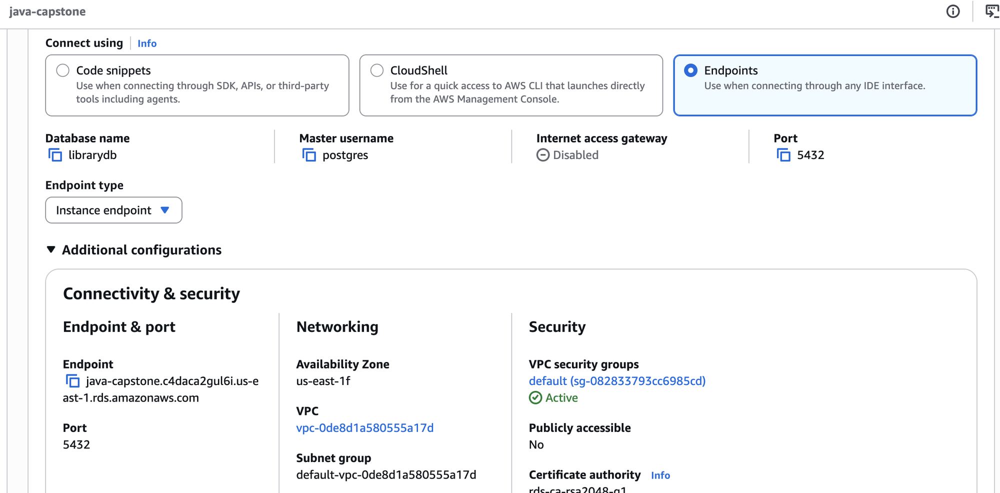

---

## Part 2: Application Preparation

### Install Required NuGet Packages

For each microservice, add PostgreSQL support:

```bash
# Navigate to each service directory and run:
dotnet add package Npgsql.EntityFrameworkCore.PostgreSQL --version 10.0.3
dotnet add package Microsoft.EntityFrameworkCore.Design --version 10.0.10
```

You already have `Microsoft.EntityFrameworkCore.InMemory` from local development. It stays for the `Development`
branch of `Program.cs` below and is never used by the deployed app.

### Update Program.cs for Production

For each service, modify database configuration:

```csharp
// Configure database based on environment
if (builder.Environment.IsDevelopment())
{
    builder.Services.AddDbContext<YourDbContext>(options =>
        options.UseInMemoryDatabase("YourServiceDb"));
}
else
{
    // Each service reads its OWN connection string key: UserDb, CatalogDb or ReservationDb.
    // All three services share one set of environment variables in production, so a shared
    // "DefaultConnection" would point every service at the same database.
    var connectionString = builder.Configuration.GetConnectionString("CatalogDb");
    builder.Services.AddDbContext<YourDbContext>(options =>
        options.UseNpgsql(connectionString));
}

var app = builder.Build();

// Apply migrations on startup. With Npgsql this also CREATES the database if it does not exist yet,
// which is how catalogservicedb and reservationservicedb come into being on the shared RDS instance.
if (!app.Environment.IsDevelopment())
{
    using var scope = app.Services.CreateScope();
    scope.ServiceProvider.GetRequiredService<YourDbContext>().Database.Migrate();
}
```

**Why `Database.Migrate()` instead of `dotnet ef database update`?** In class you applied migrations from your
laptop with `dotnet ef database update`, which connects to the database directly. That is not possible here: the
RDS instance is not publicly accessible, so nothing on your machine can reach it. `Database.Migrate()` is the same
operation performed by the service itself when it starts on the Beanstalk instance, which is inside the VPC and
can reach RDS. With Npgsql it also creates the database (`catalogservicedb`, `reservationservicedb`) if it does not
exist yet. Do not run `dotnet ef database update` against RDS; it will time out.

Each service must also accept its port from the command line rather than hardcoding it: leave `"urls"` out of
`appsettings.json` for production, or make sure `--urls` on the command line wins. The deployment starts each
service with `--urls http://0.0.0.0:<port>`.

### Create Entity Framework Migrations

`dotnet ef migrations add` builds your `Program.cs` to discover the `DbContext`, so `GetConnectionString("CatalogDb")`
must return something at design time or it fails with "Unable to create a DbContext". Put a placeholder in each
service's `appsettings.Development.json` (`migrations add` only reads it, it never connects; don't run
`dotnet ef migrations list` or `database update`, both try to connect and will fail without a local Postgres):

```json
{
  "ConnectionStrings": {
    "CatalogDb": "Host=localhost;Port=5432;Database=catalogservicedb;Username=postgres;Password=postgres"
  }
}
```

Use `UserDb` and `ReservationDb` in the other two. Then, for each service (`dotnet restore` first, or `dotnet ef`
reports "Unable to retrieve project metadata"):

```bash
# Install EF Core Tools globally (once)
dotnet tool install --global dotnet-ef
export PATH="$PATH:$HOME/.dotnet/tools"

# User Service
cd UserService
dotnet restore
dotnet ef migrations add InitialCreate
ls Migrations
cd ..

# Catalog Service
cd CatalogService
dotnet restore
dotnet ef migrations add InitialCreate
ls Migrations
cd ..

# Reservation Service
cd ReservationService
dotnet restore
dotnet ef migrations add InitialCreate
ls Migrations
cd ..
```

### Build One Deployment Bundle

All three services are deployed together in **one** Elastic Beanstalk environment, as three processes on one
instance. (The sandbox allows at most 2 EC2 instances, so three separate environments cannot be created.) The
bundle is one zip containing the three published services plus two small files that tell Elastic Beanstalk how to
run and route them.

Create these two files once, in the repository root:

`Procfile` (no extension). One line per service. The one named `web` must listen on port 5000, because that is
where Elastic Beanstalk's nginx sends requests for `/`.

```
web: dotnet ./UserService/UserService.dll --urls http://0.0.0.0:5000
catalog: dotnet ./CatalogService/CatalogService.dll --urls http://0.0.0.0:5002
reservation: dotnet ./ReservationService/ReservationService.dll --urls http://0.0.0.0:5003
```

`.platform/nginx/conf.d/elasticbeanstalk/services.conf`. Routes `/catalog/...` and `/reservations/...` to the
other two processes. The directory name matters: this is the one folder Elastic Beanstalk includes inside its
`server` block.

```nginx
location /catalog/ {
    proxy_pass http://127.0.0.1:5002/;
    proxy_http_version 1.1;
    proxy_set_header Host $host;
}
location /reservations/ {
    proxy_pass http://127.0.0.1:5003/;
    proxy_http_version 1.1;
    proxy_set_header Host $host;
}
```

Then build the bundle:

```bash
rm -rf bundle
dotnet publish UserService        -c Release -o bundle/UserService
dotnet publish CatalogService     -c Release -o bundle/CatalogService
dotnet publish ReservationService -c Release -o bundle/ReservationService
cp Procfile bundle/
cp -r .platform bundle/
(cd bundle && zip -r ../library-microservices.zip .)
```

Verification: Peek inside the zip to see what we're about to push:

Migrations are compiled into each service's DLL by `dotnet publish`; you will not see a `Migrations` folder in the
zip, and that is correct. Verify the zip has the right shape (the `Procfile` and `.platform` folder must be at the
root, not inside a subfolder):

```bash
unzip -l library-microservices.zip | grep -E "Procfile|services.conf|\.dll$"
```


---

## Part 3: Elastic Beanstalk Deployment

### Before you start

- Have the RDS endpoint and master password from Part 1 to hand.
- Have `library-microservices.zip` built (Part 2).
- Generate the JWT secret now so you can paste it: `openssl rand -base64 32`
- Region must still be **us-east-1**.

> **Sandbox limits:** the sandbox denies `ec2:RunInstances` for any instance type other than **`t3.medium`**. The
> Elastic Beanstalk form defaults to `t3.micro` and `t3.small`. If you leave those in, the environment fails to
> launch. The instance type is set in the **Infrastructure** section below.

### Create the application and environment

> **A word about words.** Elastic Beanstalk calls its top-level folder an *application* and the running instance an
> *environment*. You create **one** Beanstalk application and **one** environment. Your **three** ASP.NET
> applications (User, Catalog, Reservation) all run inside that one environment, as three processes started by the
> `Procfile`. "One application" below always means the Beanstalk folder, never your services.

**AWS Console → Elastic Beanstalk → Applications → Create application**, name it `library-microservices`, then
**Create new environment**. The console shows everything on one page with collapsible sections. Work through it top
to bottom. Every setting you must change is listed here; leave anything not mentioned at its default.

| Section              | Setting                    | Value                                                  |
|----------------------|----------------------------|--------------------------------------------------------|
| Environment details  | Application name           | `library-microservices`                                |
|                      | Environment name           | `library-microservices-env`                            |
|                      | Domain name prefix         | Leave blank (auto-generated)                           |
|                      | Platform                   | .NET Core on Linux                                     |
|                      | Platform branch            | .NET 10 running on 64bit Amazon Linux 2023             |
|                      | Platform version           | Recommended                                            |
| Application code     | Source                     | Local file → `library-microservices.zip`               |
|                      | Version label              | `v1.0.0` (increment for each deployment)               |
| Environment properties | Add environment properties | Tick it, then add the variables in the table below   |
| Service access       | Service role               | Create default role (`aws-elasticbeanstalk-service-role`) |
|                      | EC2 instance profile       | Create default role (`aws-elasticbeanstalk-ec2-role`)  |
|                      | EC2 key pair               | Leave empty                                            |
| Infrastructure       | Environment tier           | Web server environment                                 |
|                      | Environment type           | Single instance                                        |
|                      | Fleet composition          | On-Demand Instance                                     |
|                      | Architecture               | x86_64                                                 |
|                      | **Instance types**         | **Remove `t3.micro` and `t3.small`, add `t3.medium`, nothing else** |
|                      | Root volume type           | [Platform default]                                     |
| Networking           | VPC                        | [Default VPC] (same as RDS)                            |
|                      | Instance subnets           | Leave the pre-selected subnets                         |
|                      | **EC2 security groups**    | **Add `default`.** This is what lets the instance reach RDS. Skip it and the app cannot connect to the database. |
| Monitoring and updates | Health reporting         | Basic                                                  |
|                      | Log streaming, S3 logs, X-Ray | Off                                                 |
|                      | Deployment policy          | All at once                                            |
|                      | **Managed platform updates** | **Untick "Enable managed updates"**                  |

**Environment properties.** All three processes see the same variables, which is why each service has its own
connection string key. Don't include the `[]` in your actual values.

| Name                                | Value                                                                                                   |
|-------------------------------------|---------------------------------------------------------------------------------------------------------|
| `ASPNETCORE_ENVIRONMENT`            | `Production`                                                                                            |
| `ConnectionStrings__UserDb`         | `Host=[RDS-ENDPOINT];Port=5432;Database=userservicedb;Username=postgres;Password=[YOUR-PASSWORD]`        |
| `ConnectionStrings__CatalogDb`      | `Host=[RDS-ENDPOINT];Port=5432;Database=catalogservicedb;Username=postgres;Password=[YOUR-PASSWORD]`     |
| `ConnectionStrings__ReservationDb`  | `Host=[RDS-ENDPOINT];Port=5432;Database=reservationservicedb;Username=postgres;Password=[YOUR-PASSWORD]` |
| `Jwt__Secret`                       | Output of `openssl rand -base64 32`. Shared by all three services                                       |
| `Jwt__Issuer`                       | `LibraryManagementApi`                                                                                  |
| `Jwt__Audience`                     | `LibraryManagementApiUsers`                                                                             |
| `ServiceUrls__UserService`          | `http://localhost:5000`                                                                                 |
| `ServiceUrls__CatalogService`       | `http://localhost:5002`                                                                                 |
| `ServiceUrls__ReservationService`   | `http://localhost:5003`                                                                                 |

The services talk to each other over `localhost` because they run on the same instance. No security group rules
between them are needed.

### Step-by-step with screenshots

**1. Environment details, platform, application code.** Application `library-microservices`, environment
`library-microservices-env`, domain blank, Platform **.NET Core on Linux**, branch **.NET 10 running on 64bit Amazon
Linux 2023**, version Recommended. Application code: Local file → `library-microservices.zip`, version label `v1.0.0`.

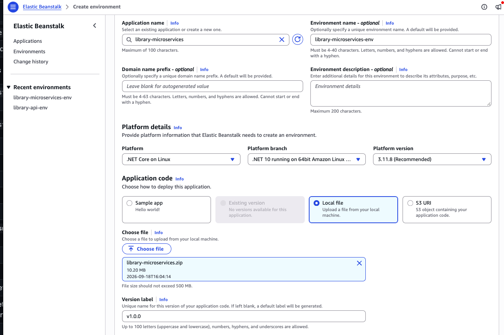

**2. Environment properties.** Tick **Add environment properties** and add all ten. The value column is cut off on
screen; the third row is scrolled to the end to show the `Username=postgres;Password=...` tail. Use your own RDS
endpoint and master password.

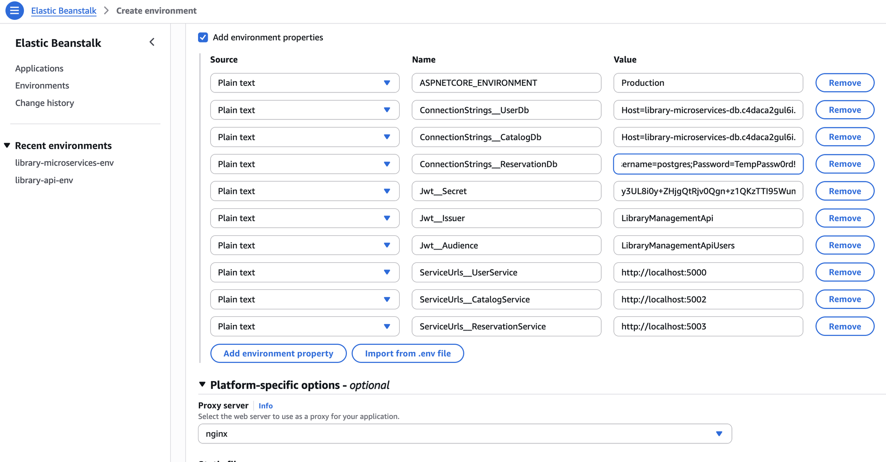

The remaining screenshots were taken deploying the Java capstone; the Beanstalk screens are identical from here on.

**3. Service access.** Expand it. Leave both on **Create default role**.

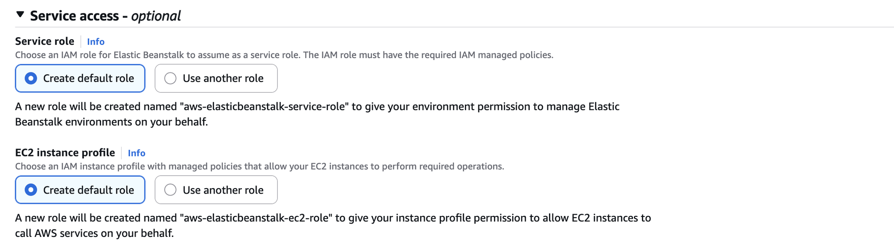

**4. Infrastructure: tier and scaling.** Web server environment, **Single instance**, On-Demand.

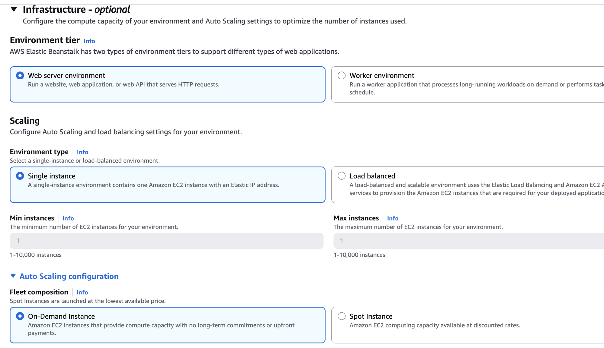

**5. Infrastructure: compute.** Under **Instance types**, **Remove** `t3.micro` and `t3.small`, then **Add instance
type** → `t3.medium`. Only `t3.medium` when you are done.

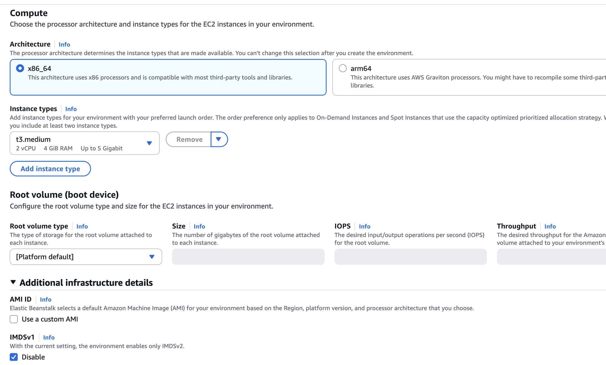

**6. Networking.** Default VPC, subnets pre-selected (the blue note about us-east-1e is normal). Under **EC2 security
groups**, open the dropdown and pick **`default`** (it shows as `sg-... (default)`, "default VPC security group").
This is what lets the instance reach RDS; skip it and every service fails to start.

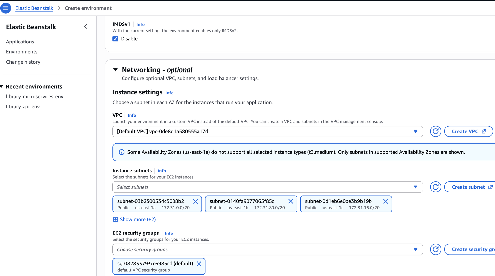

**7. Monitoring and logging.** Health reporting **Basic**. Everything else unticked.

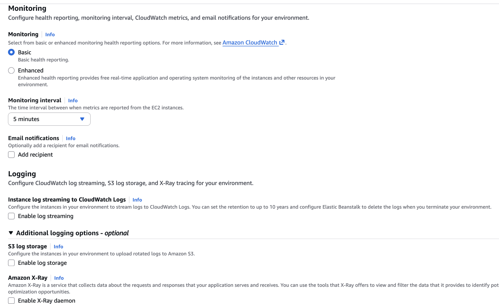

**8. Deployments and managed updates.** All at once. **Untick "Enable managed updates"**.

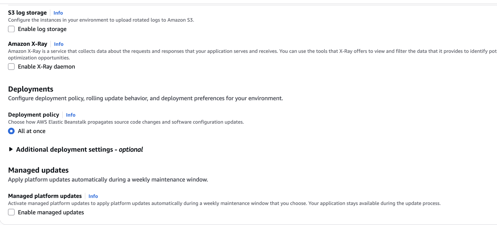

**9. Create.** Expand **Review**, confirm Instance types shows `t3.medium` only, Security groups shows `default`,
Managed updates shows "Turned off", and Environment properties lists all ten. Click **Create**. Wait 5-10 minutes
for "Environment successfully launched" and Health **Green**.

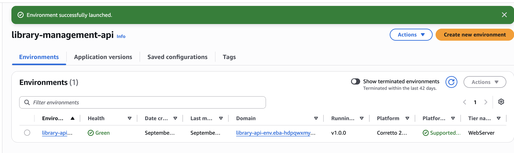

Because the instance is in the `default` security group from the start, the services can reach RDS on their first
boot. On that first boot each service runs its migrations, which creates `catalogservicedb` and
`reservationservicedb`. There is no separate security-group step.

---

## Verification

### Test Each Service

All three services share one hostname. User Service answers at the root, the other two under a path prefix.
Replace `EB` with the domain shown on the environment page.

```bash
EB=http://library-microservices-env.xxxxxxxx.us-east-1.elasticbeanstalk.com

# Health checks, one per service
curl $EB/health
curl $EB/catalog/health
curl $EB/reservations/health
```

Each one must report its own service name and its own database. `migrations: 1` (or however many you have) means
the service reached RDS, created its database if needed, and applied its migrations on startup. Three UP responses
with three different database names is the proof that the whole deployment works.

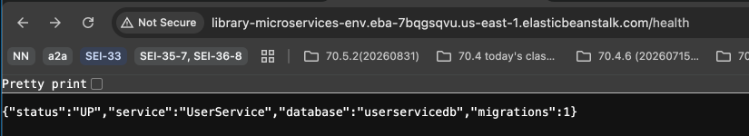

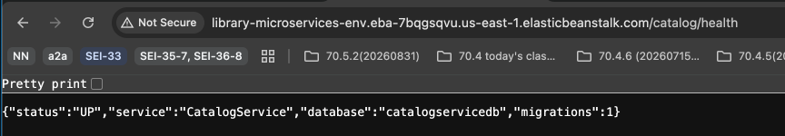

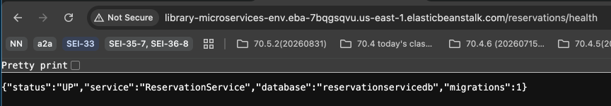

**User Service:**

```bash
# Swagger UI
open $EB/swagger

# Register a user
curl -X POST $EB/api/auth/register \
  -H "Content-Type: application/json" \
  -d '{
    "email": "test@example.com",
    "password": "Test123!@#",
    "firstName": "Test",
    "lastName": "User",
    "phoneNumber": "+1-555-0123"
  }'

# Login
curl -X POST $EB/api/auth/login \
  -H "Content-Type: application/json" \
  -d '{
    "email": "test@example.com",
    "password": "Test123!@#"
  }'
```

**Catalog Service:**

```bash
open $EB/catalog/swagger
curl $EB/catalog/api/catalog/books
```

**Reservation Service:**

```bash
open $EB/reservations/swagger

# Create reservation (requires token from User Service login)
curl -X POST $EB/reservations/api/reservations \
  -H "Content-Type: application/json" \
  -H "Authorization: Bearer [YOUR-JWT-TOKEN]" \
  -d '{
    "bookId": "[BOOK-ID-FROM-CATALOG]"
  }'
```

### Check Application Logs

- **Elastic Beanstalk Console → library-microservices-env → Logs → Request Logs → Last 100 Lines**

Each Procfile process has its own log, named after the process: `web.stdout.log`, `catalog.stdout.log`,
`reservation.stdout.log` under `/var/log/`.

Look for:

- Successful database connection
- Applied migrations
- Application startup confirmation

---

## Common Issues & Solutions

### Issue: `rds:CreateDBInstance` not authorized

The sandbox policy only allows database creation when the instance class is `db.t3.micro`, storage is 21 GiB or
less, Multi-AZ is off and the region is us-east-1. The most common cause is the instance class.

### Issue: 502 Bad Gateway on `/catalog/` or `/reservations/` but `/` works

nginx is not routing to the other two processes. Either `.platform/nginx/conf.d/elasticbeanstalk/services.conf`
is missing from the zip, or it is in a different directory (only that exact path is included in nginx's `server`
block). Check with `unzip -l library-microservices.zip`.

### Issue: One service is down, the other two work

Read that process's log: `catalog.stdout.log` or `reservation.stdout.log` in the request logs. A service that
crashes on startup is almost always a connection string problem (`ConnectionStrings__CatalogDb` misspelled or
pointing at the wrong database name).

### Issue: 502 Bad Gateway on everything right after launch

The `default` security group was not added under Networking → EC2 security groups, so no service can reach RDS
and all three exit. Fix it after the fact: EC2 → Security Groups → `default` → Edit inbound rules → add
PostgreSQL (5432) with source = the `awseb-e-...-AWSEBSecurityGroup-...` group, then Elastic Beanstalk → Actions →
Restart app server(s).

### Issue: Service Can't Connect to Database

**Check:**

- Connection string format is correct with double underscores (`__`)
- RDS endpoint matches exactly
- Database name is correct for each service
- The instance is in the `default` security group (Networking → EC2 security groups)
- The service reads its own key (`ConnectionStrings__UserDb`, `__CatalogDb`, `__ReservationDb`)
- Database credentials are correct
- RDS instance status is "Available"

### Issue: Services Can't Communicate

**Check:**

- `ServiceUrls__*` point at `http://localhost:5000`, `5002`, `5003`, not at a public hostname
- The Procfile ports match those URLs
- All three processes are running (each `/health` answers)

### Issue: JWT Token Validation Fails

**Check:**

- JWT secret is identical across User Service and Reservation Service
- Jwt__Issuer and Jwt__Audience match across services
- Token is being sent with "Bearer " prefix

### Issue: Migrations Not Applied

**Check:**

- `Migrations/` folder existed in the service's source when you ran `dotnet publish` (it is compiled into the DLL)
- `Database.Migrate()` is called in Program.cs (this also creates the database)
- Application has permission to create tables
- Check logs for migration errors

---

## Deployment Checklist

### RDS Setup

- [ ] RDS PostgreSQL instance created (`library-microservices-db`, `db.t3.micro`)
- [ ] Database status is "Available"
- [ ] RDS endpoint documented and saved
- [ ] `userservicedb` created via Initial database name

### Bundle

- [ ] `Procfile` and `.platform/nginx/conf.d/elasticbeanstalk/services.conf` in the repository root
- [ ] Each service reads its own connection string key and calls `Database.Migrate()` on startup
- [ ] `library-microservices.zip` built with all three services and both files at the root

### Elastic Beanstalk

- [ ] One environment created, instance type `t3.medium` only, `default` security group added
- [ ] Managed platform updates turned off
- [ ] All ten environment properties configured
- [ ] Environment health shows Green
- [ ] `/health`, `/catalog/health`, `/reservations/health` all answer
- [ ] `catalogservicedb` and `reservationservicedb` appear on the RDS instance after first boot
- [ ] Swagger UI accessible for all three services
- [ ] User registration works and login returns JWT token
- [ ] Catalog browsing works
- [ ] Can create reservations with authentication
- [ ] Waitlist expiry background job is running (check `reservation.stdout.log` for its periodic output)

### End-to-End Testing

- [ ] Complete reservation workflow works (reserve → checkout → return)
- [ ] Profile endpoint shows statistics from Reservation Service (User → Reservation over localhost)
- [ ] Book availability updates via Catalog Service (Reservation → Catalog over localhost)
- [ ] Role-based authorization enforced

---

## Additional Resources

- ASP.NET Core Configuration: https://docs.microsoft.com/en-us/aspnet/core/fundamentals/configuration/
- AWS Elastic Beanstalk .NET: https://docs.aws.amazon.com/elasticbeanstalk/latest/dg/dotnet-linux-platform.html
- AWS RDS PostgreSQL: https://docs.aws.amazon.com/AmazonRDS/latest/UserGuide/CHAP_PostgreSQL.html
- Entity Framework Core Migrations: https://docs.microsoft.com/en-us/ef/core/managing-schemas/migrations/
